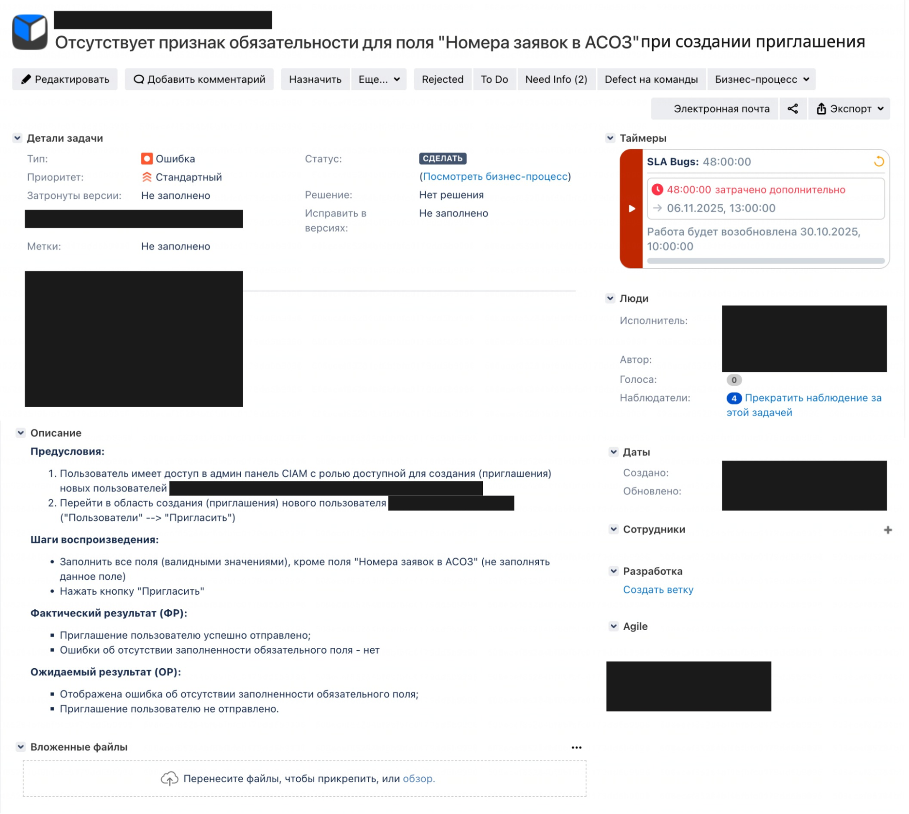
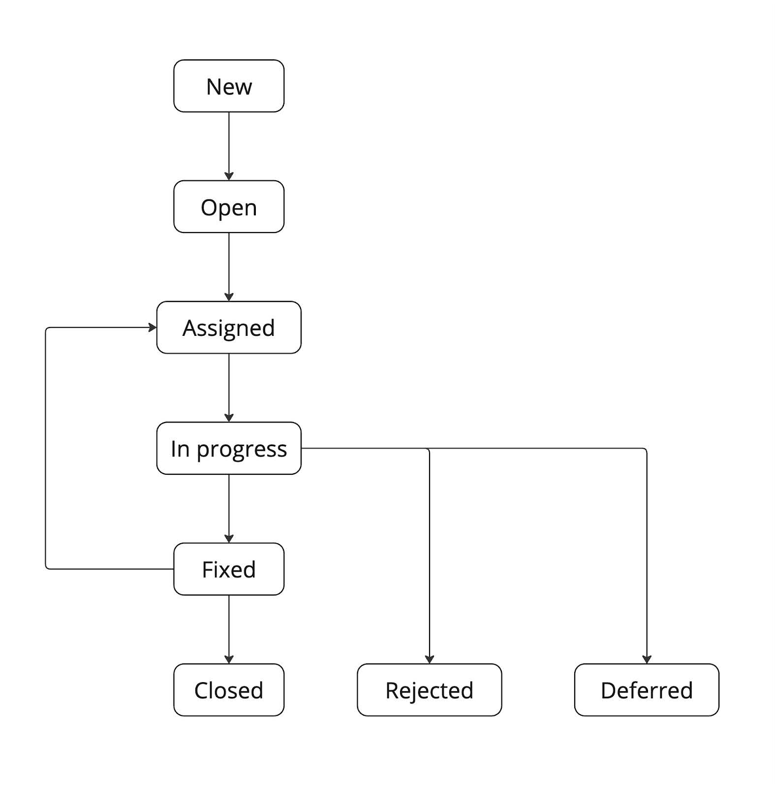

# Дефекты

В данном проекте ты на практике научишься составлять качественные баг-репорты (т.е. такие, после прочтения которых у разработчика не останется вопросов, что и где нужно чинить), узнаешь последовательность действий, которую надо сделать до заведения баг-репорта.

💡 [Нажми сюда](https://new.oprosso.net/p/4cb31ec3f47a4596bc758ea1861fb624), **чтобы оставить отзыв на этот проект**. Это анонимно и поможет нашей команде «Школы 21» сделать обучение по этому проекту лучше. Рекомендуем заполнить опрос сразу после выполнения проекта.

## Содержание

  - [Глава 1](#глава-1)
    - [Общая инструкция](#общая-инструкция)
  - [Глава 2](#глава-2)
    - [Общая информация](#общая-информация)
  - [Глава 3](#глава-3)
    - [Баг (дефект)](#баг-дефект)
  - [Глава 4](#глава-4)
    - [Виды дефектов](#виды-дефектов)
    - [Задание 1. Виды дефектов](#задание-1-виды-дефектов)
    - [Причины появления дефектов](#причины-появления-дефектов)
    - [Задание 2. Причины появления дефектов](#задание-2-причины-появления-дефектов)
    - [Локализация дефекта](#локализация-дефекта)
  - [Глава 5](#cглава-5)
    - [Баг-репорт](#баг-репорт)
    - [Задание 3. Составить баг-репорт](#задание-3-составить-баг-репорт)
    - [Жизненный цикл баг-репорта](#жизненный-цикл-баг-репорта)
    - [Задание 4. Жизненный цикл баг-репорта](#задание-4-жизненный-цикл-баг-репорта)

## Глава 1
### Общая инструкция
Как учиться в «Школе 21»: 

1. В «Школе 21» тебя ждет уникальный образовательный опыт с большим количеством свободы. Ты получаешь задачу и самостоятельно находишь информацию, чтобы ее решить. Можешь использовать все доступные средства поиска информации - ресурсы Интернета не ограничены. Но внимательно относись к источникам информации (например, если используешь нейросети): проверяй, думай, анализируй, сравнивай. 
2. Взаимообучение (Peer-to-Peer, P2P) — это обмен знаниями и опытом с другими пирами, где каждый выступает и учителем, и учеником. Такой подход позволяет глубже понять материал, учась друг у друга.  
3. Чувствуй себя свободно и проси о помощи — вокруг тебя те, кто тоже впервые проходят этот путь. Делись своим опытом и идеями с другими. Присоединяйся к RocketChat, чтобы быть в курсе всех новостей от нашего сообщества.  
4. Твое обучение не будет иметь никакого смысла, если ты будешь копировать чужие решения. Если пользуешься помощью других — всегда разбирайся до конца, почему, как и зачем. Не бойся ошибиться.   
5. Кажется, что задача невыполнима? Сделай перерыв, проветрись, перезагрузи голову — это помогало многим. Возможно, после этого решение придет само собой.  
6. Важен не только результат обучения, но и сам процесс. Нужно не просто решить задачу, а понять, КАК ее решить. 

Как работать с проектом:

1. Перед выполнением проект необходимо склонировать с GitLab в одноименный репозиторий.
2. Все файлы необходимо создавать в папке *src/* склонированного репозитория.
3. После клонирования проекта необходимо создать ветку `develop` и вести разработку в ней. После этого пушить в GitLab также нужно ветку `develop`.
4. В твоей директории не должно быть иных файлов, кроме тех, что обозначены в заданиях.

## Глава 2
### Общая информация

Оформление баг-репорта — еще одна повседневная активность тестировщика. По тому, насколько грамотно составлен баг-репорт, можно многое сказать о тестировщике и даже определить его квалификацию.

Баг-репорт — это отчет о проблеме, со своей структурой, который состоит из набора полей.
В этом проекте ты узнаешь возможные причины появления дефектов, 
разберешь назначение каждого поля баг-репорта, некоторые особенности при заполнении данных полей.

Для того чтобы лучше понять и освоить процесс оформления баг-репорта, ты выполнишь практическое задание по данной теме.

## Глава 3
### Баг (дефект)

Баг (дефект) — это неожиданный/некорректный результат работы программы.

От этапа разработки, на котором будут выявлены баги, зависит очень многое. Чем раньше мы выявим баг и сообщим о нём команде, тем меньше накопится ошибок в программном коде разрабатываемого продукта, и тем быстрее мы сможем выпустить продукт в релиз.

Цена каждого найденного дефекта, пусть даже небольшого, разнится на каждой стадии жизненного цикла. Если при тестировании баг найден в документации, которую еще не отдали в работу разработчикам, то цена дефекта очень мала, так как для исправления нужно изменить всего несколько строк текста. И наоборот, когда дефект был найден пользователем — это самый дорогой баг, т. к. помимо предстоящих временных затрат, мы имеем репутационные убытки.

## Глава 4
### Виды дефектов

В зависимости от того, как «выглядят» дефекты или как «себя ведут», их можно разделить на виды. 

Для выполнения следующего задания сначала самостоятельно изучи различные подходы к классификации багов.

### Задание 1. Виды дефектов

1. Исследуй историю известных багов в истории IT, выбери минимум 3 примера наиболее интересных тебе.
2. Проведи анализ для каждого кейса и оформи выводы в таблицу в документе *task\_1.md.*

| Вид дефекта | Почему не был обнаружен при тестировании? | Какие виды тестирования могли бы его найти? | Экономические/репутационные последствия |
|-------------|-------------------------------------------|---------------------------------------------|-----------------------------------------|
| Пример      |                                           |                                             |                                         |

### Причины появления дефектов

Причин возникновения дефектов достаточно много. Самой частой причиной является человеческий фактор, который может присутствовать на любом этапе жизненного цикла разработки ПО (отдельное внимание теме жизненного цикла уделялось в проекте  QA_01_Foundation).

Перечислим несколько причин появления дефектов:

- ошибки в спецификации / техническом задании;
- ошибки при написании кода разработчиком (например, из-за слишком сложной логики функциональности, недостаточности времени для написания кода и т. д.);
- плохая коммуникация в команде;
- ошибки в инструментах разработки.

### Задание 2. Создание анти-шаблона тестирования

1. Проанализируй перечисленные выше причины появления дефектов. 
2. На основе анализа создай список из 5-7 "анти-шаблонов" - типичных ошибок в подходе к тестированию, которые приводят к пропуску критических дефектов. При составлении старайся сделать материалы максимально применимыми в  использовании в работе. 
1. Выполненное задание оформи в документе *task\_2.md.*

### Локализация дефекта

Отличительной чертой квалифицированного тестировщика является его умение локализовать дефект. То есть не просто его найти, но и показать разработчику то место в продукте, в котором (или из-за которого) возник дефект. Чем точнее тестировщик может указать причину дефекта, тем меньше времени разработчику понадобится на его устранение.

Локализация дефекта практически невозможна без инструментов тестирования/разработки, с которыми ты познакомишься в следующих проектах.

## Глава 5
### Баг-репорт

Прежде чем продолжить изучение баг-репорта (отчета о найденном дефекте), сначала проговорим те действия, которые надо сделать перед его созданием:

1. Повтори баг (воспроизведи его ещё раз);
1. Удостоверься в его уникальности (возможно, кто-то уже его нашел и оформил, а дубли дефектов нам не нужны 🙂);
1. Максимально локализуй его;
1. Вот теперь дефект можно оформлять (максимально подробно).

Теперь поговорим про важные составляющие для **некоторых** полей баг-репорта. Мы не будем сейчас перечислять все поля, а рассмотрим только те, на которых нужно заострить внимание, потому что при их заполнении могут быть нюансы. 

**Заголовок** — краткое описание сути бага. Заголовок следует писать, основываясь на принципе «Что? Где? Когда?»:

- **Что?** — что происходит / не происходит согласно документации / представлению о нормальной работе продукта.
- **Где?** — в каком элементе ПО возникает дефект.
- **Когда?** — при каких действиях возникает дефект.

При написании заголовка стоит избегать слов «Плохо», «Неправильно» и им подобных, так как они не точно описывают суть проблемы.

Поля  **“Приоритет” (Priority)** и **“Серьезность” (Severity)** бага

Приоритет показывает, насколько срочно нужно исправить ошибку.
Серьезность описывает, насколько сильно ошибка аффектит на бизнес-логику работы приложения или затрудняет использование его функций.

Значения в полях “Приоритет” и “Серьезность” помогать принять решение об очередности исправлений выявленных дефектов. 

“Приоритет” и “Серьезность” - это разные вещи. 

Серьезность может быть— Critical - например, дефект сильно влияет на работу приложения. Но бизнес-логика приложения на следующей неделе будет изменена или выведена из продукта. Поэтому приоритет будет Low (низкий). Это значит, что нет смысла тратить время и силы на исправление этого бага.
Или серьезность может быть — Trivial, приоритет - High. 
Подумай и попробуй представить, что это может быть за ситуация, и какой дефект мог бы быть.

**Поле «Вложения».** Очень важное поле именно для тестировщика. В данном поле складываются все «доказательства» по найденному дефекту. Это могут быть снимки экрана, видеозапись поведения приложения, логи работы системы/приложения и т. д. 

Причин для заполнения этого поля этого минимум две:

1. Сэкономить время разработчику в локализации дефекта;
1. Доказательство, что «баг был», особенно актуально в случае «плавающих» багов (баг, который то есть, то нет).

Важно помнить и знать о принципе «Один дефект — один репорт». Если на проблему уже заведен баг-репорт, второй заводить не нужно, это только создаст замешательство о количестве багов в системе. С другой стороны, если багов несколько, даже если они возникают в одном и том же окне и имеют общие черты, не стоит пытаться описать их всех одним репортом, лучше завести по репорту на каждый.

Баг-репорт — ключевой тестовый артефакт. Любой найденный баг желательно сразу оформлять и отправлять разработчику именно в формате баг-репорта. В этом проекте вряд ли удастся найти баг, однако в будущих — обязательно! 😉

*Пример багрепорта в Jira. На практике, в работе различных команд, шаблоны багрепортов могут незначительно отличаться от "классического". Например в этом (скрин) нет поля "Серьёзность".*
### Задание 3. Составить баг-репорт

1. Перейди на ресурс <https://www.saucedemo.com/> и найди минимум 1 дефект (на странице авторизации или после авторизации).
2. Составь баг-репорт. В твоем баг-репорте должно быть минимум 6 обязательных полей, остальные ты можешь добавить в зависимости от уровня твоего изучения темы и желания наращивать опыт в составлении разных баг-репортов: 

   - заголовок
   - критичность
   - серьёзность
   - шаги воспроизведения
   - ожидаемый результат
   - фактический результат

3. Отдельно опиши, почему ты считаешь обнаруженный дефект именно багом, а не фичами или ожидаемым поведением. 
4. Опиши гипотезу о возможных причинах возникновения дефекта и точках исправления (техническое размышление).
5. Подумай более комплексно: проанализируй влияние дефекта на пользователя и бизнес-процессы: отдельно опиши, какие риски и неудобства он вызывает.
6. Выполненное задание оформи в документе *task\_3.md.*

### Жизненный цикл баг-репорта

Рассмотрим, что дальше будет с нашим оформленным и отданным в работу дефектом. Нагляднее всего это представить в виде диаграммы:

### Задание 4. Жизненный цикл баг-репорта
1. Самостоятельно изучи этапы жизненного цикла (какие еще состояния/статусы дефектов могут возникнуть в процессе жизненного цикла бага) и заполни таблицу по возможным этапам: 

| Этап / статус жизненного цикла баг-репорта | Что происходит | Кто и на каком этапе может менять статус баг-репорта | Пример |
| :--- | :--- | :--- | :--- |
| «New» | Дефект создан, но в работу ещё не отправлен (возможно, тестировщик уточняет какие-либо детали для данного дефекта) | Статус выставляется автоматически | 

Представь, что в процессе жизненного цикла баг-репорта возникает несколько конфликтных сценариев: 

  - Разработчик говорит "Not a bug"
  - Менеджер настаивает на "Low priority" для критичного бага
  - Баг не воспроизводится на среде у разработчика
  - Релиз блокируется одним багом

Выбери любые 2 сценария и опиши возможную стратегию коммуникации как тестировщика. Твоя цель - сформулировать максимально сильную стратегию, чтобы пройти препятствие и двигаться по workflow.

Укажи выбранную ситуацию и укажи действия (что ты будешь делать пошагово) и возможные шаблоны коммуникации (сообщения, аргументы, вопросы коллегам).

2. Выполненное задание (таблица и 2 сценария)  оформи в документе *task\_4.md.*

💡 [Нажми сюда](https://new.oprosso.net/p/4cb31ec3f47a4596bc758ea1861fb624), **чтобы оставить отзыв на этот проект**. Это анонимно и поможет нашей команде «Школы 21» сделать обучение по этому проекту лучше. Рекомендуем заполнить опрос сразу после выполнения проекта.

